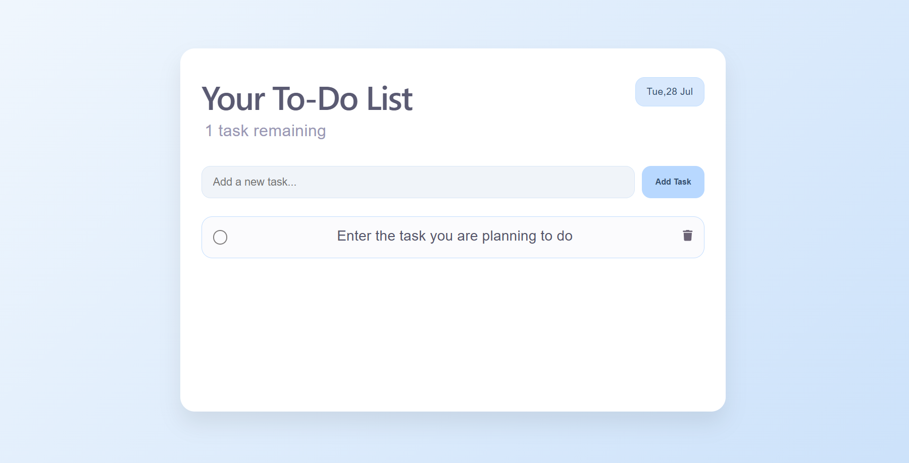

# React To-Do List

A simple, responsive To-Do List application built with **React** that helps users organize and manage their daily tasks through a clean and intuitive interface.

## Features

* Add new tasks
* Mark tasks as completed
* Delete tasks
* Display the current date
* Record the time each task is added
* Show the number of remaining tasks
* Responsive UI with a soft pastel theme

## Tech Stack

* React
* JavaScript (ES6+)
* CSS3
* React Icons

## Author

Developed by **Ekta Chauhan**.
